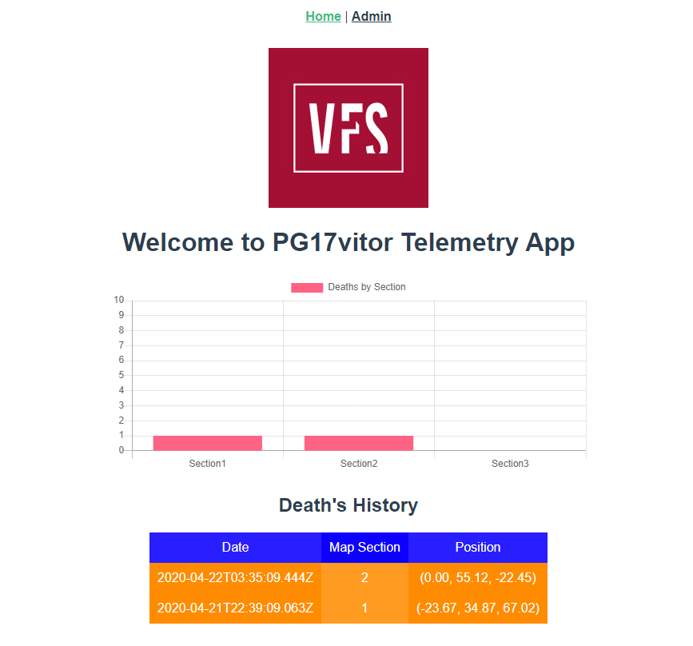

# Telemetry App for games (VFS - CloudComputing)
> Death's History based on different sections of the Map

## Description
> Client ask for the records to the python flask server that grab it from google datastore and send back to the client
- Google Datastore
- Backend: Python Flask
- Frontend: Vue

## Instaling
- Python and NPM is needed to run this project
- Download the project
- Open CommandLine (Project root folder)
- Activate Virtual Environment: venv\Scripts\activate
- Install requirements: pip install -r requirements.txt
- Open CommandLine (Project client folder)
- Install npm modules: npm install

## Setting the Cloud (Google)
- Create a project (We are going to use Datastore)
- In the Cloud Console, go to the Create service account key page and download the credentials JSON file
- Put this file outside the project (It is confidential)
- Create a new environment variable called GOOGLE_APPLICATION_CREDENTIALS with that JSON path
- Done

## Running
- Open CommandLine (Project root folder)
- Run server: flask run
- Open CommandLine (Project client folder)
- Run client: npm run serve
- Access the app at Local Host port 5000: [`localhost:5000`](http://localhost:5000/)
